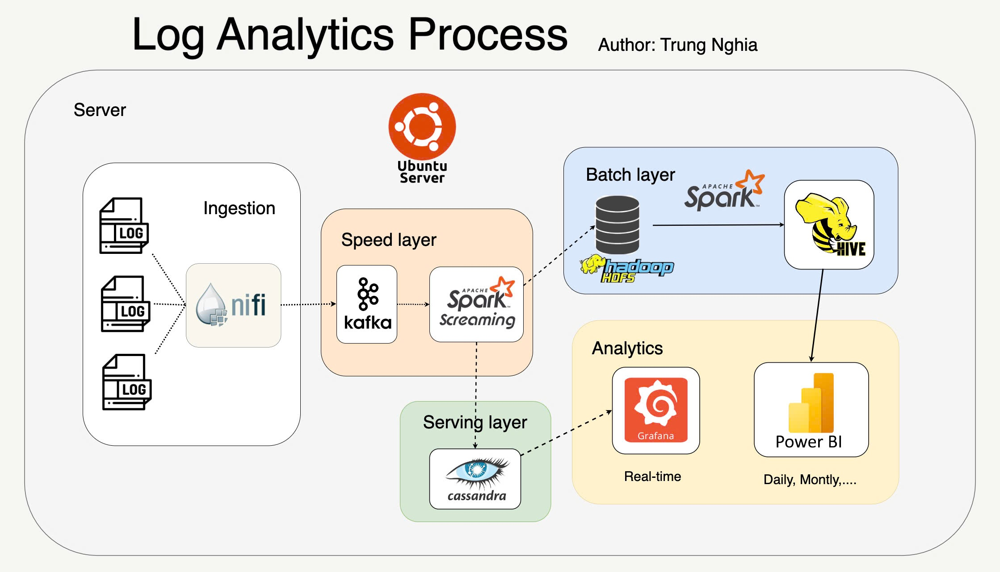
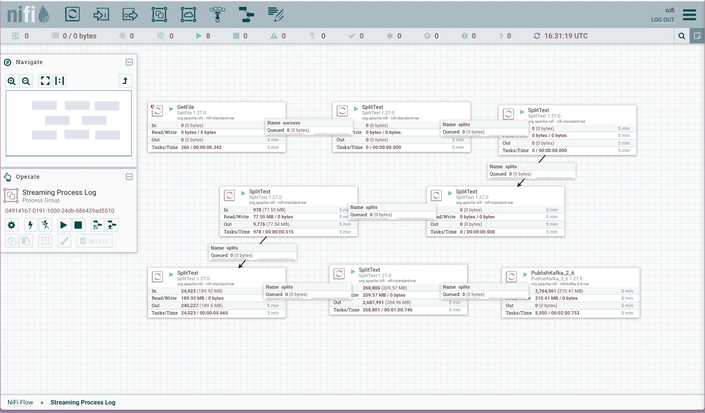
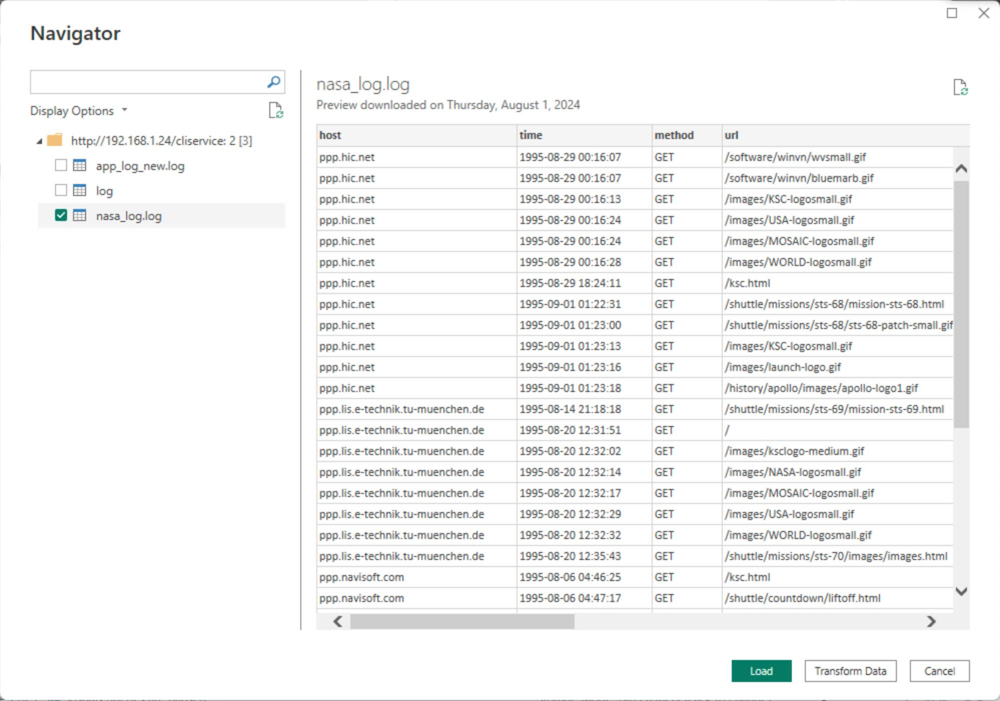
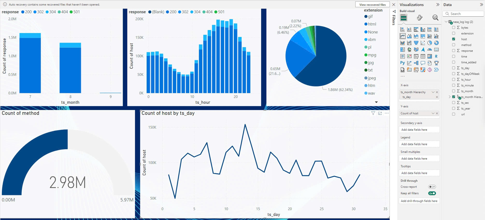
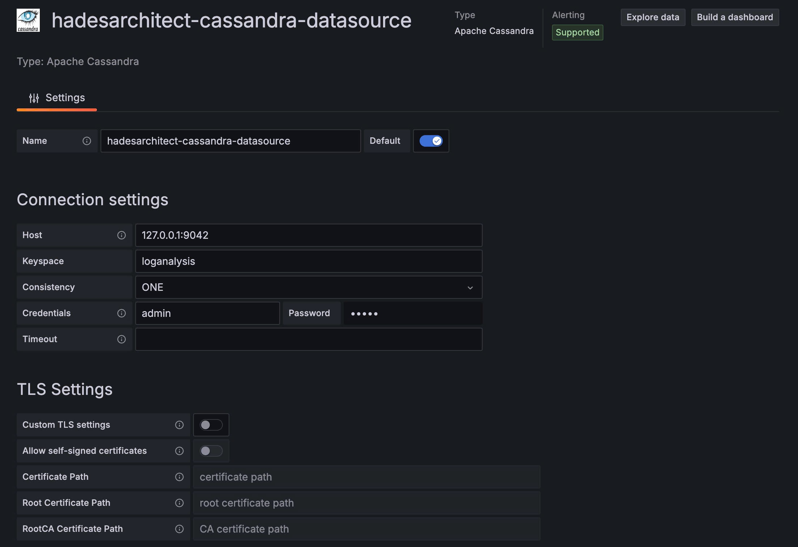
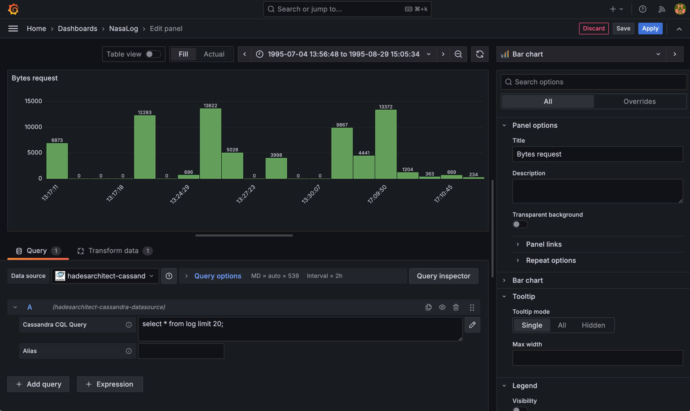
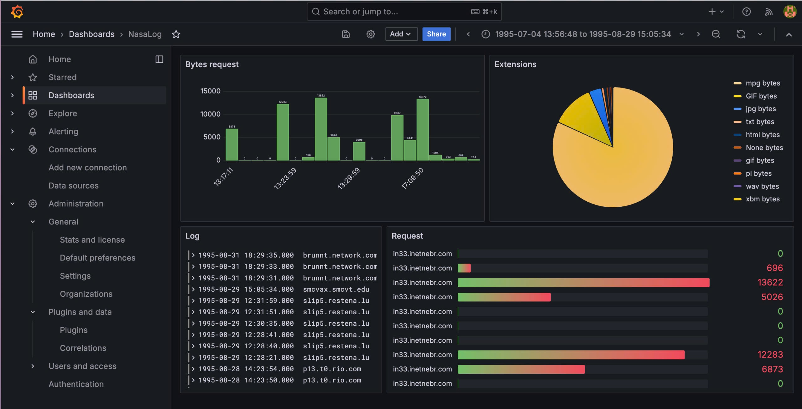
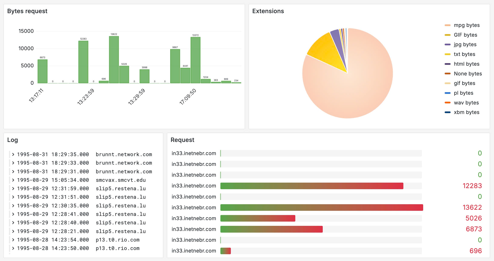
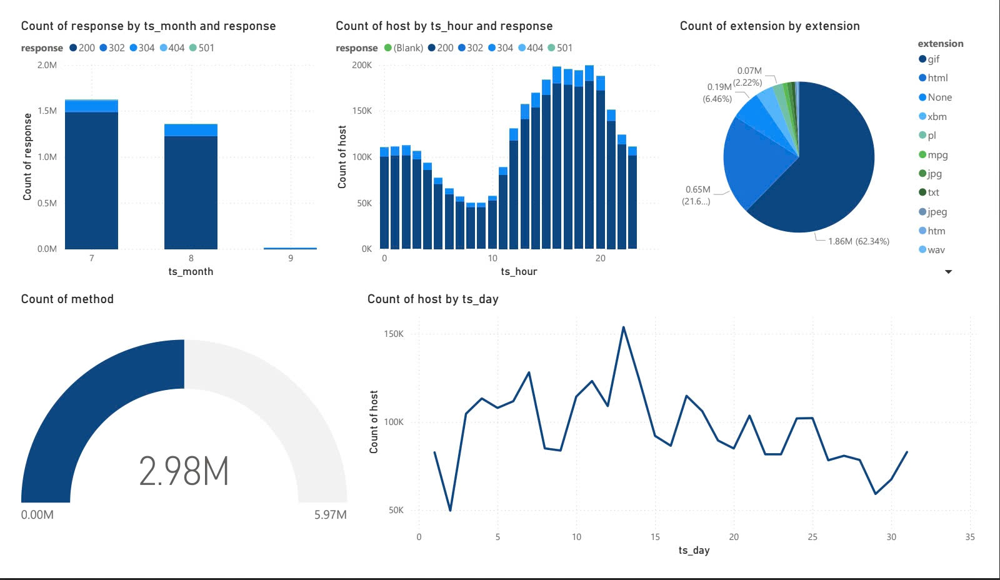

# BIG DATA PROJECT: NASA Log Analytics Process

# Table of Contents

1. **[Project Objective](#project-objective)**
2. **[Datasets Selection](#datasets-selection)**
3. **[System Architecture](#system-architecture)**
   - [Ingestion Layer](#ingestion-layer)
   - [Speed Layer](#speed-layer)
   - [Batch Layer](#batch-layer)
   - [Serving Layer](#serving-layer)
   - [Analytics Layer](#analytics-layer)
4. **[Technologies Used](#technologies-used)**
5. **[Installation and Deployment](#installation-and-deployment)**
   - [System Requirements](#system-requirements)
   - [Installation](#installation)
   - **[Running the Project](#running-the-project)**
6. **[Troubleshooting](#troubleshooting)**
   - **[Common Issues](#common-issues)**
   - **[Logs and Monitoring](#logs-and-monitoring)**
7. **[Usage](#usage)**
8. **[Results and Analysis](#results-and-analysis)**
9. **[Future Work](#future-work)**
10. **[References](#references)**
11. **[Authors](#authors)**


# Project Objective

The primary goal of this project is to develop a scalable and fault-tolerant log analytics pipeline based on the `Lambda architecture`. The system ingests, processes, and analyzes NASA server logs in both real-time and batch modes. This enables immediate insights for real-time monitoring and generates comprehensive reports for periodic analysis.

# Datasets Selection
NASA access log dataset 1995:
- <a href = https://ita.ee.lbl.gov/html/contrib/NASA-HTTP.html> Actual NASA Logs </a>

This dataset is particularly valuable for several reasons. First, it captures a high volume of real-world web traffic, providing a realistic basis for our analysis. Second, the data spans different times of the day and days of the week, enabling us to id entify patterns and trends in server usage. Lastly, the inclusion of various HTTP res ponse codes and byte sizes allows us to assess not only the traffic but also the ser ver's performance and potential issues such as error rates and load.

The logfile format is as follows:

    remotehost rfc931 authuser [date] "request" status bytes
    
# System Architecture
The system is divided into several layers, each responsible for specific tasks within the log analytics process:

<center>
    
</center>

## Ingestion Layer
- **`Apache NiFi`**: Efficiently ingests NASA logs from various sources, enabling flexible and scalable data flow management.

## Speed Layer
- **`Apache Kafka`**: Serves as a high-throughput, low-latency message broker, handling real-time data streams.
- **`Apache Spark Streaming`**: Processes data streams in real-time, enabling immediate analytics and rapid response to events. Integrates seamlessly with Kafka for continuous log processing.

## Batch Layer
- **`Hadoop HDFS`**: Acts as the primary storage for large volumes of log data, ensuring high availability and scalability.
- **`Apache Spark`**: Performs batch processing on data stored in HDFS, facilitating complex data analysis tasks.
- **`Apache Hive`**: Provides a data warehouse infrastructure, enabling efficient querying and analysis of large datasets stored in HDFS.

## Serving Layer
- **`Apache Cassandra`**: Stores processed data with fast read/write capabilities, particularly useful for real-time analytics.

## Analytics Layer
- **`Grafana`**: Offers real-time visualization of log data through dynamic dashboards and alerts.
- **`Power BI`**: Generates detailed daily, monthly, and periodic reports, providing deep insights through comprehensive visualizations.

# Technologies Used

- **Operating System**: The project is deployed on `Ubuntu Server` for the backend processes, with a component like `Power BI` running on Windows.
- **Programming Languages**: `Python` is the primary programming language used for developing the various components of the pipeline.
- **Libraries and Frameworks**: 
  - `Apache NiFi` for data ingestion.
  - `Apache Kafka` for real-time data streaming.
  - `Apache Spark` for both real-time and batch data processing.
  - `Apache Hive` for data warehousing and querying.
- **Storage**:
  - `Cassandra` is used for real-time data storage
  - `Hadoop HDFS` for distributed data storage.
- **Visualization**
   - `Grafana` for real-time data visualization.
  - `Power BI` for creating detailed reports and dashboards.

# Installation and Deployment

## System Requirements
- Java 8+
- Python 3.7+
- Apache Hadoop
- Apache Kafka
- Apache Spark
- Apache Hive
- Apache NiFi
- Grafana
- Power BI (Window)

## Installation
- Follow the [official documentation](#references) for each component to install them on an Ubuntu Server.
- The installation involves setting up `Java`, `Python`, and the big data tools (`Hadoop`, `Spark`, `Kafka`, etc.) to ensure all components are correctly configured and ready for deployment.

## Running the Project
### 1. Start `Apache Cassandra`
**1.1 Run Cassandra server**

  ```shell
  cassandra -f
  ```

**1.2 Create a Keyspace and Table**
- Access the Cassandra Query Language (CQL) shell:
  
  ```
  cqlsh -u cassandra -p cassandra
  ```
  
- Create a keyspace:
  
  ```
  CREATE KEYSPACE IF NOT EXISTS loganalysis
    WITH replication = {'class':'SimpleStrategy', 'replication_factor':1};
  ```
  
- Create a table:
  
  ```
  CREATE TABLE loganalysis.nasalog (
      host text,
      time text,
      bytes text,
      extension text,
      method text,
      response text,
      time_added text,
      url text,
      PRIMARY KEY (host, time)
  ) WITH CLUSTERING ORDER BY (time ASC)
      AND additional_write_policy = '99p'
      AND bloom_filter_fp_chance = 0.01
      AND caching = {'keys': 'ALL', 'rows_per_partition': 'NONE'}
      AND cdc = false
      AND comment = ''
      AND compaction = {'class': 'org.apache.cassandra.db.compaction.SizeTieredCompactionStrategy', 'max_threshold': '32', 'min_threshold': '4'}
      AND compression = {'chunk_length_in_kb': '16', 'class': 'org.apache.cassandra.io.compress.LZ4Compressor'}
      AND crc_check_chance = 1.0
      AND default_time_to_live = 0
      AND extensions = {}
      AND gc_grace_seconds = 864000
      AND max_index_interval = 2048
      AND memtable_flush_period_in_ms = 0
      AND min_index_interval = 128
      AND read_repair = 'BLOCKING'
      AND speculative_retry = '99p';
  ```
  
- Truncate table:
  
  ```
  TRUNCATE TABLE loganalysis.nasalog;
  ```
  
### 2. Start `Apache Kafka`
**2.1 Run Kafka server**
- Generate a new cluster ID:
  
  ```
  kafka-storage.sh random-uuid
  ```
  
- Generate the log storage:
  
  ```
  kafka-storage.sh format -t <uuid> -c config/kraft/server.properties
  ```

- Start Kafka Server:
  
  ```
  kafka-server-start.sh config/kraft/server.properties
  ```
  
**2.2 Create a Kafka Topic**
- Use the Kafka command-line tool to create a topic:
  
  ```
  kafka-topics.sh
    --create
    --bootstrap-server localhost:9092
    --topic nasa_log
    --partitions 1
    --replication-factor 1
    --if-not-exists
  ```
  
- List topic:
  
  ```
  kafka-topics.sh
    --list
    --bootstrap-server localhost:9092
  ```

- Describe topic:
  
  ```
  kafka-topics.sh
    --describe
    --topic nasa_log
    --bootstrap-server localhost:9092
  ```
  
### 3. Start `Apache Hadoop`
**3.1 Configure Hadoop**
- Follow instructions: [HadoopSingleCluster](https://hadoop.apache.org/docs/stable/hadoop-project-dist/hadoop-common/SingleCluster.html)
  
**3.2 Start Hadoop services**
- Use the following commands:
  
  ```
  start-all.sh
  ```
  
- Run Example:
  
  ```
  hadoop jar share/hadoop/mapreduce/hadoop-mapreduce-examples-3.3.1.jar pi 4 100
  ```
  
### 4. Start `Apache NiFi`
**4.1 Run Nifi**
- Run the NiFi server:
  
  ```
  nifi.sh start
  ```
  
- Open port 8443: Ensure NiFi’s web interface is accessible at [https://localhost:8443/nifi](https://localhost:8443/nifi).

**4.2 Create workflow**
- Access NiFi’s web UI:
  
  ```
  https://localhost:8443/nifi
  ```
  
- Create and run a workflow follow:
  
  <center>
    
  </center>

### 5. Load Streaming Data into `Cassandra` and `HDFS`:
- Submit Spark applications for Data Streaming Processing:

  ```
  spark-submit
    --packages org.apache.spark:spark-sql-kafka-0-10_2.12:3.2.0,com.datastax.spark:spark-cassandra-connector_2.12:3.2.0,org.apache.kafka:kafka-clients:3.2.0
    --master yarn
    --deploy-mode cluster
    streaming.py
  ```

### 6. Start `Apache Hive`
**6.1 Configure Hive**
- Follow instructions: [HiveGettingStarted](https://cwiki.apache.org/confluence/display/Hive/GettingStarted)
  
**6.2 Start the Hive services**
- Run the schematool initialization:
  
  ```
  schematool -dbType <db type> -initSchema
  ```

- Start the Hive Metastore service:
  
  ```
  hive --service metastore
  ```
  
- Start thrift server in Spark:
  
  ```
  start-thiftserver.sh
  ```
  
### 7. Process Data and Load into `Hive`:
- Submit Spark applications for Data Processing:
  
  ```
  spark-submit
    --master yarn
    --deploy-mode cluster
    load.py
  ```

### 8. Visual periodic visualizations with `Power BI`
**8.1 Start Power BI**
- Open Power BI with other machine in Window OS
- Start Power BI Desktop and create report

**8.2 Get data from Hive**
- Select Spark and connect:
  
  ```
  Server: http://<id>:10000/cliservice
  Protocol: HTTP
  Data Connectivity mode: DirectQuery
  ```
  
- Load data from table nasa_log.log
  <center>
      
  </center>

**8.3 Build visual**

- Choose visual and attribute to build visual

  <center>
      
  </center>

### 9. Create Real-time visualizations with `Grafana`

**9.1 Start Grafana service**

  ```
  sudo systemctl start grafana-server
  ```

**9.2 Connect to Cassandra**
- Open Cassandra source and connection settings:
  
    ```
    Host: <ip>:9042
    Keyspace: loganalysis
    Consistency: ONE
    Credentials: admin
    Password: admin
    ```

  <center>
      
  </center>

**9.2 Create Dashboard from Cassandra source**
- Add dashboard and custom viusal:

  <center>
      
  </center>

- Arrange dashboard:

  <center>
      
  </center>

## Troubleshooting

### Common Issues

**1. Kafka Broker Connection Issues**
- Ensure the `Kafka broker` is correctly configured and that the server.properties file contains the correct settings.
Check that the broker is running and reachable from the network.

**2. Cassandra Connectivity Issues**
- Ensure the `Cassandra server` is up and running, and that the correct IP address and port are specified in the connection settings.
- Validate that the keyspace and table have been created as required.

**3. Hadoop Resource Manager Not Starting**
- Verify that `Java` is correctly installed and configured on your system.
- Ensure that `HDFS` and `YARN` services are correctly initialized and that no other conflicting services are running on the same ports.

### Logs and Monitoring

**1. Apache NiFi Logs**

NiFi logs are stored in the logs directory within the NiFi installation directory. Check these logs for detailed error messages and debugging information.

    cd $NIFI_HOME/logs/
    
**2.Kafka Logs**

Kafka logs are located in the logs directory within the Kafka installation. Inspect these logs to diagnose issues related to message delivery and broker connectivity.

    cd $KAFKA_HOME/logs/
    
**3. Spark Logs**

Spark logs can be found in the logs directory of your Spark installation. These logs contain information about the execution of your Spark applications, including details of any errors encountered.

    cd $SPARK_HOME/logs/
    
**4. Cassandra Logs**

Cassandra logs reside in the /var/log/cassandra directory. Review these logs for any issues related to data storage and query execution.
    
    cd $CASSANDRA_HOME/logs/

# Usage

- **Input Data**: NASA server logs, including access logs, error logs, and application logs.
- **Running Data Processing Jobs**:
  - Real-time processing: Kafka + Spark Streaming jobs
  - Batch processing: Spark jobs on data stored in HDFS
- **Output Data**:
  - Real-time metrics displayed on Grafana dashboards.
  - Aggregated and historical reports available in Power BI.

# Results and Analysis

- **Real-time Monitoring**: Provides immediate insights through `Grafana` dashboards with critical event alerts.

  <center>
      
  </center>

- **Batch Analysis**: Enables deep dives into historical data using complex queries via `Hive`, with results visualized in `Power BI`.

  <center>
      
  </center>

# Future Work

The project is designed to be extensible and scalable, with several avenues for future enhancement:

- **Advanced Machine Learning Models**: Incorporate machine learning models to predict future server load and detect anomalies in real-time.
  
- **Integration with Other Data Sources**: Extend the system to ingest and process logs from additional sources, such as application logs or network logs, to provide a more comprehensive view of system performance.
  
- **Deployment in a Distributed Environment**: Transition from a single-node setup to a fully distributed deployment across multiple nodes or cloud environments, utilizing containerization technologies like `Docker` or `Kubernetes`.
  
- **Enhanced Visualization**: Develop more complex dashboards and reports in `Grafana` and `Power BI`, enabling deeper insights and more effective monitoring.

# References

- [Apache NiFi Documentation](https://nifi.apache.org/docs.html)
  
- [Apache Kafka Documentation](https://kafka.apache.org/documentation/)
  
- [Apache Spark Documentation](https://spark.apache.org/docs/latest/)
  
- [Hadoop Documentation](https://hadoop.apache.org/docs/stable/)
  
- [Hive Documentation](https://cwiki.apache.org/confluence/display/Hive/Home)
  
- [Cassandra Documentation](https://cassandra.apache.org/doc/latest/)

- [Grafana Documentation](https://grafana.com/docs/grafana/latest/)

# Authors
Nguyen Trung Nghia
- Contact: trungnghia294@gmail.com
- GitHub: [Ren294](https://github.com/Ren294)
- Linkedln: [tnghia294](https://www.linkedin.com/in/tnghia294/)
